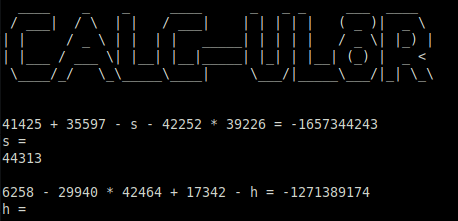
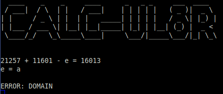
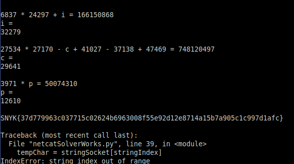
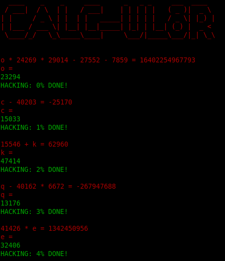
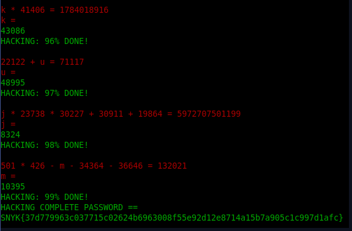

# Calculator

On the challenge you were given the command ```nc 35.211.207.36 8000``` and when running the command you are greeted with ```CALC-UL8R``` in ASCII art, and an equation with a line after with the variable and an equals sign. After putting in the right value it prints a new equation, and if you give the wrong solution it gives ```ERROR: DOMAIN```.

Correct Answer:\
\
Incorrect Answer:\
\

So my first thought was that you need to solve a bunch of equations, and it will give you the flag as a scripting challenge. So the first thing I did was start trying to figure out a way to parse the equation and solve for the variable that was being asked for. After some googling I found sympy that appearred to do everything I wanted by taking an equation as a string and solving it. Though I did run into some issues where the parser did not like the equal sign, so I split up the line using this code in while loop.

```py
tempChar = f.read(1)
    if tempChar == '=':
        randomVal = false
    elif tempChar == '\n':
        randomVal = false
    else: 
        stringEquation = stringEquation + tempChar
```

This did require me to create two individual expression then set them equal to each other before being about to actually get the solution and print it.

```py
eq1 = parse_expr(stringEquation)
eq2 = parse_expr(stringEquation2)
equation = Eq(eq1, eq2)

sol = solve(equation)
print(sol)
```

Since I had it reading from a text file, I thought let's just try piping the netcat output into a file then having the script parse, and send back the appropriate responses. That however, was a colossal failure, and something I could not get working. My next thought was to use a socket, which seemed rather daunting since I had never used it before, but after realizing that is the best option by far. I decided to jump in head first and figure it out.

After doing some reading on the socket library in python, and some tutorials and writeups from CTFs with similar challenges. I was confident enough that I could figure out what I needed to do to get the challenge working properly and get the flag. It did take some trail and error, but I did eventually get the script to work and proceed through all the right numbers. 

```py
from sympy import *
import socket
import time

# Creates and connects to the socket that is hosting the challenge
s = socket.socket(socket.AF_INET, socket.SOCK_STREAM)
s.connect(("35.211.207.36", 8000))
# Wait 2 seconds because it was occasionally slow and this guarteed dat
time.sleep(2)
# Receive the data from the socket and then convert it to a string
data = s.recv(1024)
stringSocket = data.decode('utf-8') 
# Print out the data received from the socket so you can see what is happening
print(stringSocket)
# Skip to position 331 in the string since that was the fixed length at the beginning without an equation
stringIndex = 331

# Set an arbitrary high number to loop through
for i in range(500):
    # Initate a boolean for the while loop and a string to store the equation before the equal sign
    randomVal = true
    stringEquation = ''
    while randomVal:
        # Takes the character at the stringIndex and sees if it is an equals sign or a new line, if it isn't adds it to the string
        tempChar = stringSocket[stringIndex]
        stringIndex = stringIndex + 1
        if tempChar == '=':
            randomVal = false
        elif tempChar == '\n':
            randomVal = false
        else: 
            stringEquation = stringEquation + tempChar

    # Initate a boolean for the while loop and a string to store the equation after the equal sign
    randomVal = true
    stringEquation2 = ''
    while randomVal:
        # Takes the character at the stringIndex and sees if it is an equals sign or a new line, if it isn't adds it to the string
        tempChar = stringSocket[stringIndex]
        stringIndex = stringIndex + 1 
        if tempChar == '=':
            randomVal = false
        elif tempChar == '\n':
            randomVal = false
        else: 
            stringEquation2 = stringEquation2 + tempChar
    
    # Use sympy to parse the strings before and after the equal signs into equations that sympy can use
    eq1 = parse_expr(stringEquation)
    eq2 = parse_expr(stringEquation2)

    # Create an equation that sets the part before the equals sign to the part after it
    equation = Eq(eq1, eq2)
    # Solve the equation and put the value for the variable into an array
    sol = solve(equation)
    # Convert the int to the string for easier printing and encoding
    numString = str(sol[0])
    # Sends the correct answer encoded back to the server
    s.send(str.encode(numString))
    # Prints the value sent to the server so you can see what is happening
    print(sol[0])
    # Wait a second to make sure the server had responded
    time.sleep(1)
    # Grab the new data and convert it into a string
    newData = s.recv(1024)
    stringSocket = newData.decode('utf-8') 
    # Print the string so you know what is going on
    print(stringSocket)
    # Sets the stringIndex back to one as the new data is only the new equation
    stringIndex = 1
```

Unintentionally, parsing the equation in the way that I did has an error when the flag is given causing the script to crash after the flag is printed out.



After the flag was printed out ```SNYK{37d779963c037715c02624b6963008f55e92d12e8714a15b7a905c1c997d1afc}```, I copied it and got the points.

At the time I was doing this competition in a workspace with glass windows behind me and my computer screen up on the monitor, so I decided to add some color and flare to script to make it more fun and something that I could have up on the monitor instead of just my desktop background. Which also gave me the opportunity to learn a little about the Colorama library which I used to add color to the output.




[Script with added color](netcatSolverWorks_colored_.py)

